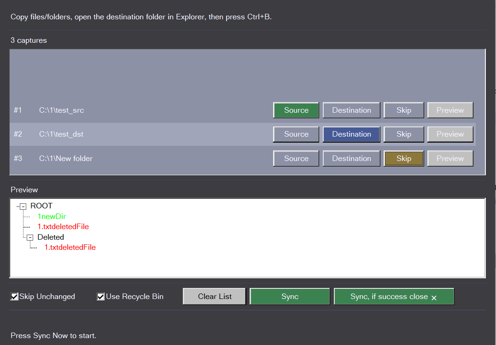

### sync_copy rust

same as https://github.com/Yuki2ka/dev_helper/blob/main/dev_helper/apply/sync_copy.py but in rust

A minimal, cross-platform (Windows + Linux) smart mirror synchronizer, that skip same hash to save SSD.

do smart sync: different (hash) or new files paste, same skip, obsolete remove
it use recycle bin so overwrite or delete are not persistent

- always-on-top window with suggestion select folder or files.
- User copies files/folders (`Ctrl+C`). This create source, destinations in gui.
- 1st row is active explorer window path
- User goes to destination folder and presses **`Ctrl+B`** or button in GUI.
- App shows confirmation: **"Content of folder will be REPLACED (mirrored)"**.
- On approval it does:
  - New/changed files (by hash) → copy (old move to Recycle Bin / Trash)
  - Identical files → skip
  - Files in destination not in source → move to Recycle Bin / Trash
- Window stays open for multiple operations.
- should works when out of focus. update gui immediately after changes, even if GUI not focused
- have button to preview changes before apply sync

- buttons  "sync" "sync, if success close ❌ "
- multiple destination possible

- title-bar close warns if sync is running.

- 1st row is for active explorer tab - this row is always exist and get path from active explorer

NEW → Green
UPDATED → Yellow
DELETED → Red
UNCHANGED → Gray

destinations may be only single folders, but not files or list of multiple objects. so properly spawn status and disallow change to dest
=== not implemented

- robocopy cant hash, but if user accept only date+size difference  - it may be faster run it by std::process::Command
- minimal gui and app size, better console in-place updating
